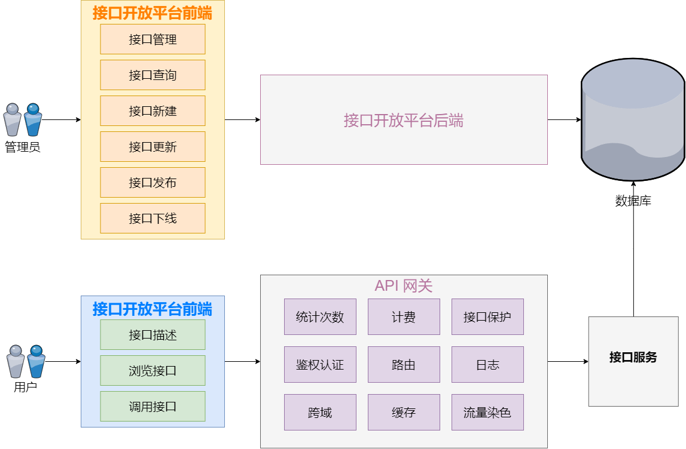
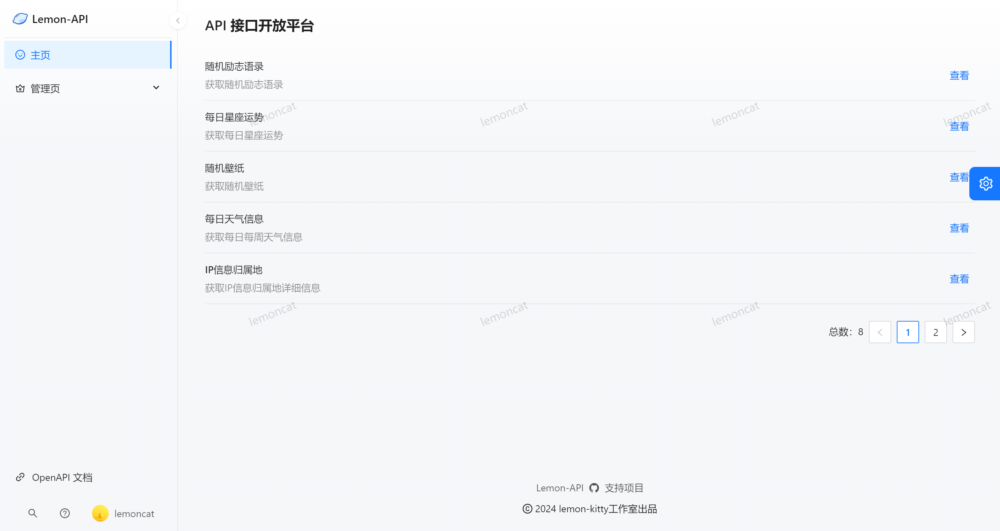
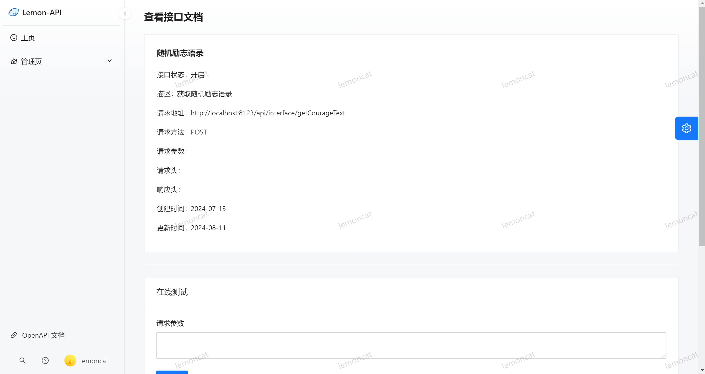
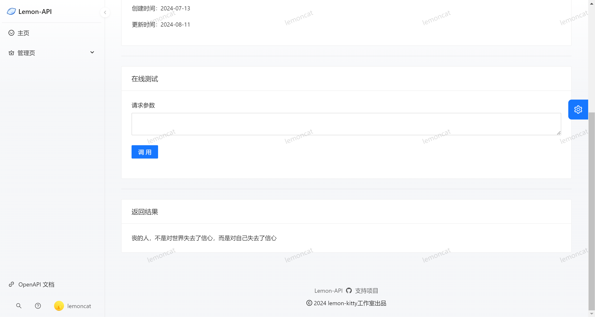
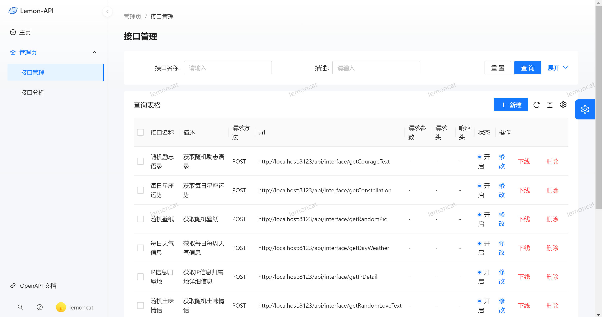
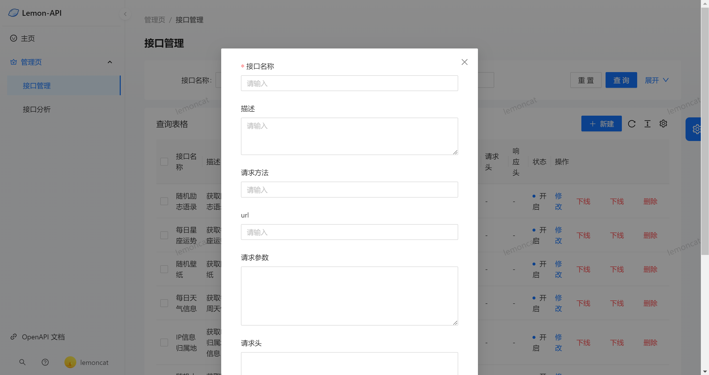
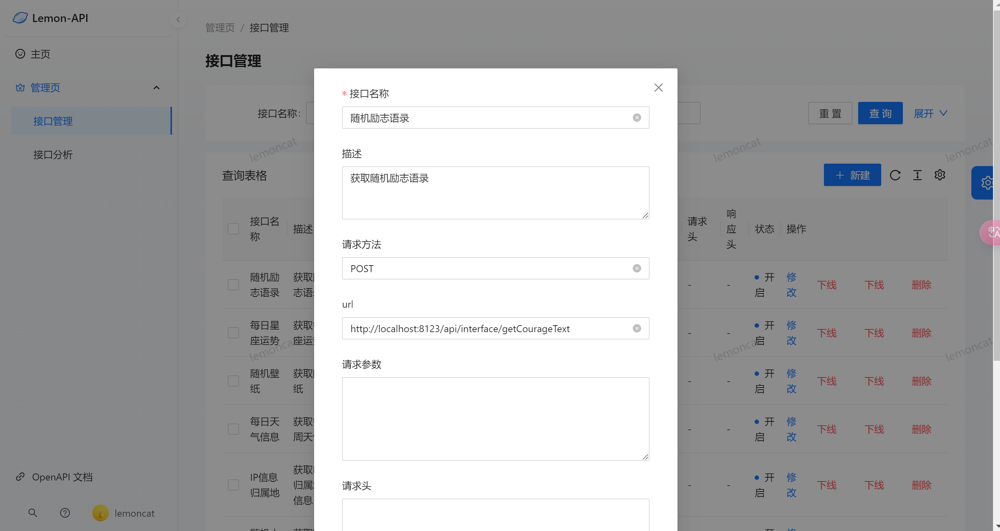
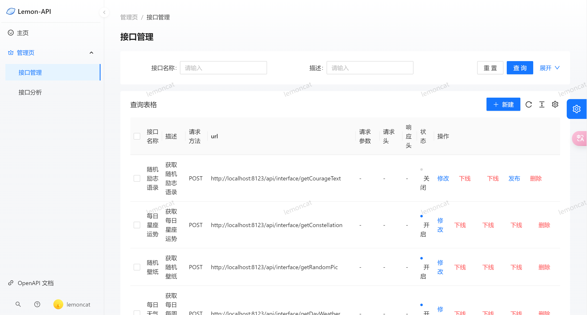
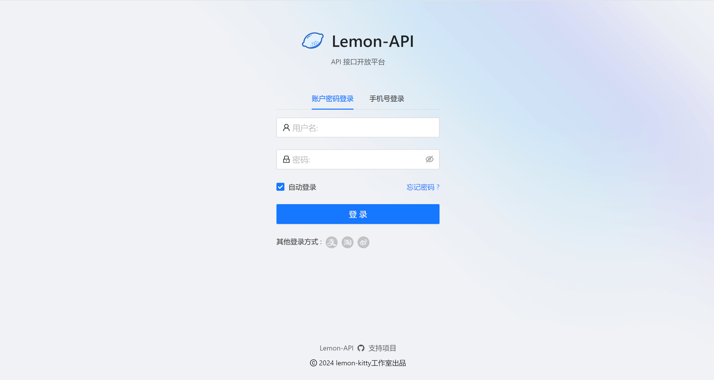

<p align="center">
    
</p>
<h1 align="center">Lemon-API 接口开放平台</h1>
<p align="center"><strong>Lemon-API 接口开放平台是一个为用户和开发者提供全面API接口调用服务的平台 🛠</strong></p>
<div align="center">
    
	<a target="_blank" href="https://www.oracle.com/technetwork/java/javase/downloads/index.html">
        
	</a>
    


## 项目介绍 

**作为用户您可以通过注册登录账户，获取接口调用权限，并根据自己的需求浏览和选择适合的接口。您可以在线进行接口调试，快速验证接口的功能和效果。** 

**作为开发者 我们提供了[客户端SDK: Lemon-API-SDK](https://github.com/lemon-kitty/lemon-api/tree/main/lemon-client-sdk)， 通过[开发者凭证]()即可将轻松集成接口到您的项目中，实现更高效的开发和调用。** 

**您可以将自己的接口接入到Lemon-API 接口开放平台平台上，并发布给其他用户使用。 您可以管理和各个接口，以便更好地分析和优化接口性能。** 

 **无论您是用户还是开发者，Lemon-API 接口开放平台都致力于提供稳定、安全、高效的接口调用服务，帮助您实现更快速、便捷的开发和调用体验。**

## 网站导航 

- [**Lemon-API 后端 **](https://github.com/lemon-kitty/lemon-api/tree/main/lemon-api-backend)
- [**Lemon-API 前端 **️](https://github.com/lemon-kitty/lemon-api/tree/main/lemon-api-frontend)
- **[Lemon-API-SDK](https://github.com/lemon-kitty/lemon-api/tree/main/lemon-client-sdk)** 


## 目录结构 


| 目录                                                         | 描述                  |
| ------------------------------------------------------------ | --------------------- |
| **[lemon-api-backend](./lemon-api-backend)**                 | Lemon-API后端服务模块 |
| **[lemon-api-common](./lemon-api-common)**                   | 公共服务模块          |
| **[lemon-api-gateway](./lemon-api-gateway)**                 | 网关模块              |
| **[lemon-api-interface](./lemon-api-interface)**             | 接口模块              |
| **[lemon-qpi-sdk](https://github.com/lemonmu666/lemon-api-sdk)** | 开发者调用sdk         |
| **[Lemon-API-SDK-Demo]()**                                   | sdk调用Demo           |


## 项目流程 



## 快速启动 

### 前端

环境要求：Node.js >= 16

安装依赖：

```bash
yarn or npm install
```

启动：

```bash
yarn run dev or npm run start:dev
```

部署：

```bash
yarn build or npm run build
```

### 后端

执行sql目录下ddl.sql


## 项目选型 

### **后端**

- Spring Boot 2
- Spring MVC
- MySQL 数据库
- Dubbo 分布式（RPC、Nacos）
- Spring Cloud Gateway 微服务网关
- API 签名认证（Http 调用）
- Swagger + Knife4j 接口文档
- Spring Boot Starter（SDK 开发）
- Apache Commons Lang3 工具类
- MyBatis-Plus 及 MyBatis X 自动生成
- Hutool、Apache Common Utils、Gson 等工具库


### 前端

- React

- Ant Design Pro 5 脚手架

- Ant Design & Procomponents 组件库

- Umi 4 前端框架

- OpenAPI 前端代码生成


## 功能介绍 

| **功能**                 | 游客 | **普通用户** | **管理员** |
| ------------------------ | ---- | ------------ | ---------- |
| 搜索接口、浏览接口       | ✅    | ✅            | ✅          |
| 邮箱验证码登录注册       | ✅    | ✅            | ✅          |
| Lemon-API-SDK使用        | ❌    | ✅            | ✅          |
| 在线调试接口             | ❌    | ✅            | ✅          |
| 用户管理                 | ❌    | ❌            | ✅          |
| 接口管理、接口发布、下架 | ❌    | ❌            | ✅          |


## 功能展示 

### 首页




### 接口描述

#### **在线API**



#### 在线调试工具


### 接口管理

#### 接口查询



#### 接口新增


#### 接口更新

#### 接口发布/下线



### 登录/注册

